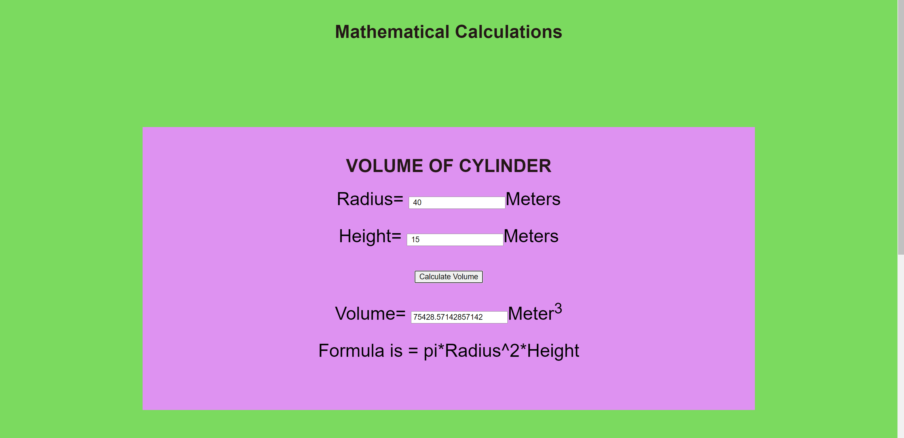

# Web Page for Mathematical Calculations

## AIM:

To design a static website with validation to perform mathematical calculations in client side.

## DESIGN STEPS:

### Step 1:

Requirement collection.

### Step 2:

Creating the layout using HTML and CSS.

### Step 3:

Write javascript to perform the calculations.

### Step 4:

Include regularexpression based input validation.

### Step 5:

Validate the layout in various browsers.

### Step 6:

Validate the HTML code.

### Step 6:

Publish the website in the given URL.

## PROGRAM :
```
<!DOCTYPE html>
<html lang="en">
<head>
    <meta charset="UTF-8">
    <meta http-equiv="X-UA-Compatible" content="IE=edge">
    <meta name="viewport" content="width=device-width, initial-scale=1.0">
    <title>Mathematical Calculations</title>
    <style>
    * {
        box-sizing: border-box;
        font-family: Arial, Helvetica, sans-serif;
      }
      body {
        background-color:rgb(123, 218, 95);
      }
      .container {
        width: 1080px;
        margin-left: auto;
        margin-right: auto;
      }
      .content {
        display: block;
        width: 100%;
        background-color: #de92f1;
        min-height: 500px;
        margin-top: 150px;
      }
      .content2{
          display: block;
          width: 100%;
          background-color: #3eb39f;
          min-height: 500px;
          margin-top: 150px;
          margin-bottom: 150px;
      }
      h1{
          text-align: center;
          padding-top: 50px;
          color: rgb(36, 23, 23);
          font-style: bold;
      }
      .formelement{
          text-align: center;
          font-size:xx-large;
          margin-top: 5px;
          margin-bottom: 5px;
      
      }
      .auth{
          text-align: center;
          color:black;
          font-family: Georgia, 'Times New Roman', Times, serif;
          font-size:xx-large;
      }
    </style>
    
</head>
<body>
    <h1>Mathematical Calculations</h1>
    <div class="container">
        <div class="content">
            <h1>VOLUME OF CYLINDER</h1>
                  <form>
                      <div class=formelement>
                          <lable for="radedit">Radius=</lable>
                          <input type="text" id="radedit" value=" "/>Meters
                      </div><br>
                      <div class=formelement>
                          <lable for="htedit">Height=</lable>
                          <input type="text" id="htedit" value=" "/>Meters
                      </div><br>
                      <div class=formelement>
                          <input type="button" value="Calculate Volume" id="calbutton"/>
                      </div><br>
                      <div class=formelement>
                          <lable for="volumeedit">Volume=</lable>
                          <input type="text" id="volumeedit" readonly="0"/>Meter<sup>3</sup>
                      </div><br>
                      <div class=formelement>
                      Formula is = pi*Radius^2*Height
                      </div>
                  </form>
        </div>
        <script type="text/javascript">
            document.querySelector("#calbutton").addEventListener("click",function(){
                var volumefield;
                var radedit,reg,res;
                volumefield=document.querySelector("#radedit");
                radedit=volumefield.value;
                reg= new RegExp("^[1-9]+[0-9]*$");
                res= radedit.match(reg);
                if (res==null)
                {
                    alert("please enter correct value for radius.");
                }
                else{
                    alert("correct")
                }
                var volumefield2;
                var htedit,reg2,res2;
                volumefield2=document.querySelector("#htedit");
                htedit=volumefield2.value;
                reg2= new RegExp("^[1-9]+[0-9]*$");
                res2= htedit.match(reg2);
                if(reg2==null)
                {
                    alert("please enter correct value for height.")
                }
                else{
                    alert("correct")
                }
            });
        </script>
        <script type="text/javascript">
            var button;
            button=document.querySelector("#calbutton");
            button.addEventListener("click",function(){
                var radtext,httext,volumetext;
                var radval,htval,volumeval;
                radtext=document.querySelector("#radedit");
                httext=document.querySelector("#htedit");
                volumetext=document.querySelector("#volumeedit");

                radval=parseInt(radtext.value);
                htval=parseInt(httext.value);
                volumeval=22/7*radval*radval*htval;
                volumetext.value=volumeval;
            });
        </script>
        
        <div class="content2">
            <h1>VOLUME OF CONE</h1>
            <form>
                <div class="formelement">
                    <lable for="radiusedit">Radius=</lable>
                    <input type="text" id="radiusedit" value=" "/>Meters
                </div><br>
                <div class="formelement">
                    <lable for="heightedit">Height=</lable>
                    <input type="text" id="heightedit" value=" "/>Merers
                </div><br>
                <div class="formelement">
                    <input type="button" value="Calculate Volume" id="calbutton1"/>
                </div><br>
                <div class="formelement">
                    <lable for="voledit">Volume=</lable>
                    <input type="text" id="voledit" readonly="0"/>Meter<sup>3</sup>
                </div><br>
                <div class="formelement">
                Formula is:V=π*Radius^2*Height/3
                </div><br>
            </form>
        </div>
        <script type="text/javascript">
            document.querySelector("#calbutton1").addEventListener("click",function(){
                var Volumefield;
                var radiusedit,reg,res;
                Volumefield=document.querySelector("#radiusedit");
                radiusedit=Volumefield.value;
                reg= new RegExp("^[1-9]+[0-9]*$");
                res= radiusedit.match(reg);
                if(res==null)
                {
                    alert("please enter correct value for radius.");
                }
                else{
                    alert("correct")
                }
                var Volumefield2;
                var heightedit,reg,res;
                Volumefield2=document.querySelector("#heightedit");
                heightedit=Volumefield2.value;
                reg= new RegExp("^[1-9]+[0-9]*$");
                res= heightedit.match(reg);
                if(reg==null)
                {
                    alert("please enter correct value for height.")
                }
                else{
                    alert("correct")
                }
            });
        </script>
        <script type="text/javascript">
            var button;
            button=document.querySelector("#calbutton1");
            button.addEventListener("click",function(){
                var radiustext,heighttext,voltext;
                var radiusval,heightval,volval;
                radiustext=document.querySelector("#radiusedit");
                heighttext=document.querySelector("#heightedit");
                voltext=document.querySelector("#voledit");

                radiusval=parseInt(radiustext.value);
                heightval=parseInt(heighttext.value);
                volval=22/7*radiusval*radiusval*heightval/3;
                voltext.value=volval;
            });
        </script>
        <footer> <p class="auth">Developed By :Swathika G 21500231</p></footer>
    </div>          
    
</body>
</html>
```

## OUTPUT:



## Result:

Thus a website is designed to perform mathematical calculations in the client side.
